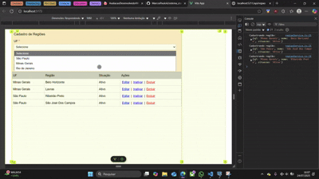

# Cadastro de Regiões

Projeto completo com **.NET 9 (Backend)**, **PostgreSQL (Banco de Dados)** e **Vue 3 + TypeScript (Frontend)** para cadastro de regiões (UF, Nome da Região e Situação).

---

## 📌 Funcionalidades

- ✅ Cadastro, edição, ativação/inativação e exclusão de regiões  
- ✅ Validação: não permite duplicidade de regiões no mesmo estado (mesmo inativas)  
- ✅ Ordenação por UF e nome da região  
- ✅ Integração total entre backend e frontend  

---

## ⚙️ Como Rodar o Projeto

### **1. Clonar o repositório**
```bash
git clone https://github.com/MarcosPauloA/sistema_crud_vue_dotnet.git
cd sistema_crud_vue_dotnet
```

---

### **2. Configurar o Banco de Dados (PostgreSQL)**

1. Crie um banco de dados chamado `cadastrodb`:
```sql
CREATE DATABASE cadastrodb;
```

2. Atualize a string de conexão no arquivo `appsettings.json`:
```json
"ConnectionStrings": {
  "DefaultConnection": "Host=localhost;Port=5432;Database=cadastrodb;Username=postgres;Password=suasenha"
}
```

3. Rode as migrations para criar as tabelas:
```bash
cd CadastroApi
dotnet ef database update
```

---

### **3. Rodar o Backend (API)**

```bash
cd CadastroApi
dotnet run
```
A API estará disponível em:  
👉 **http://localhost:5211/api/regiao**

---

### **4. Rodar o Frontend (Vue)**

```bash
cd cadastro-frontend
npm install
npm run dev
```
O frontend estará disponível em:  
👉 **http://localhost:5173**

---

## 📂 Estrutura do Projeto

```
/CadastroApi               → Backend (.NET 9 + EF Core)
/cadastro-frontend         → Frontend (Vue 3 + TypeScript)
```

---

## ✅ Rotas da API

| Método | Rota              | Descrição                      |
|--------|-------------------|--------------------------------|
| GET    | `/api/regiao`     | Lista todas as regiões         |
| GET    | `/api/regiao/{id}`| Retorna uma região específica  |
| POST   | `/api/regiao`     | Cadastra uma nova região       |
| PUT    | `/api/regiao/{id}`| Atualiza uma região existente  |
| DELETE | `/api/regiao/{id}`| Exclui uma região              |

---
## 👨‍💻 Autor

**Marcos Paulo Arbex Guida**  
📧 [mp1911@hotmail.com.br]  
🔗 [LinkedIn](https://www.linkedin.com/in/marcos-paulo-arbex-guida-a5425b26a/)

---

## 🖼️ Capturas de Tela

Clique no GIF para ver o vídeo em detalhes
[](https://youtu.be/DKPInA08z1U)


---

## 📜 Licença

Este projeto está sob a licença **MIT** – sinta-se livre para usá-lo e modificá-lo.
